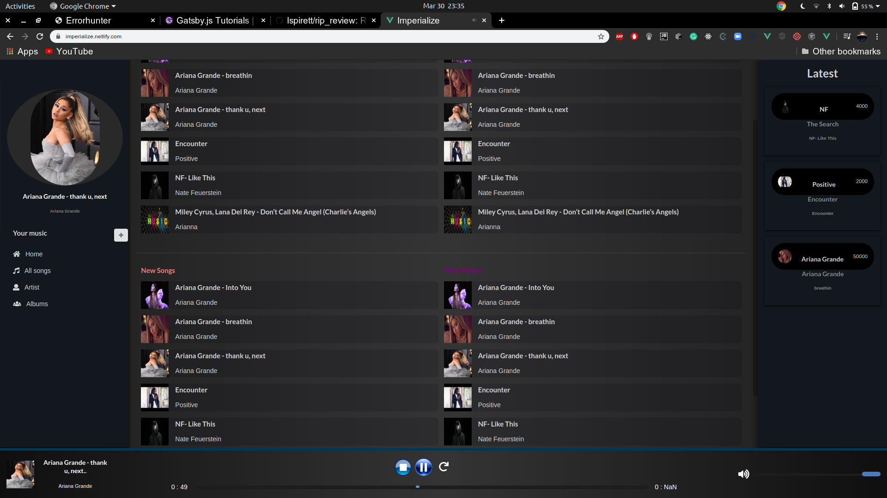

# Imperialize

#### music application built with vue



## Getting Started

These instructions will get you a copy of the project up and running on your local machine for development and testing purposes.

### Prerequisites

What things you need to install the software and how to install them
```
node
```


### Installing
```
yarn install or npm install
```


### Up and running
* create .env file in root directory.
add firebase credentials in .env file.
#### example:
```
 VUE_APP_API_KEY=key goes here
 VUE_APP_AUTH_DOMAIN=key goes here
```

```
yarn serve or npm run serve

```


## Built With
* yarn
* babelrc
* javascript
* scss
* vue
## Authors

* **Isaac Browne** - *Initial work* - [Ispirett](https://github.com/isprett)


## License

This project is licensed under the MIT License - see the [LICENSE.md](LICENSE.md) file for details


